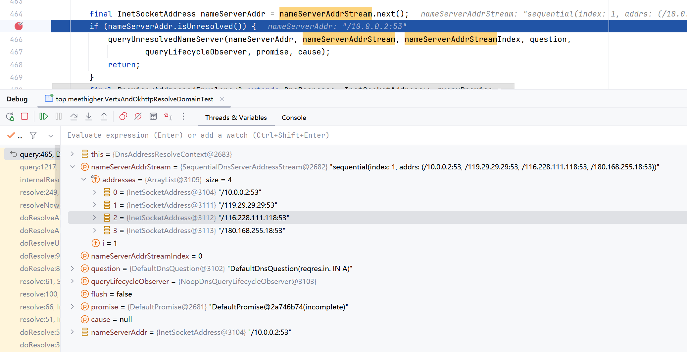

使用main方法运行以下方法

1. 运行`top.meethigher.proxy.http.VertxAndOkhttpResolveDomainTest.testOkhttp`
2. 运行`top.meethigher.proxy.http.VertxAndOkhttpResolveDomainTest.testVertxHttp`

会发现vertx httpclient明显更慢。

此处我需要借助async-profiler分析httpclient慢在哪里

问题明晰：
因为我机器本身有一个虚拟网卡，这个网卡有指定一个局域网的DNS服务器，这个就被netty自动获取到了。我传的是个互联网的域名，他通过这个解析就会等待超时，直到下一个dns服务器解析成功。

我的解决办法，任选以下其一

* 应用启动后异步的域名解析的预热逻辑。
* 应用启动时添加参数 -Dvertx.disableDnsResolver=true，禁用 Netty 内置的 DNS 解析器，使用 Java 标准库的内置 DNS 解析器。该参数支持如下工具
  * httpclient/webclient
  * netclient

