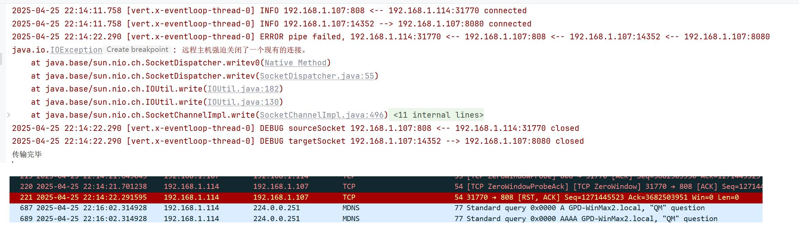

复现步骤

1. 启动一个HTTP后端服务，短连接，返回一个2MB的图片
2. 启动TcpProxyServer，代理这个HTTP后端服务。
3. 启动Jmeter，大批量调用TcpProxyServer。由于后端连接是短连接，返回数据后接着关闭targetSocket。此时由于数据还存储在pipeTo，尚未发送，而sourceSocket已经通过targetSocket.closeHandler关闭，进而导致io.netty.channel.StacklessClosedChannelException

复现问题的核心代码

```java
sourceSocket.pipeTo(targetSocket).onFailure(e -> log.error("pipe failed, {} --> {} --> {} --> {}", sourceRemote, sourceLocal, targetLocal, targetRemote, e));
targetSocket.pipeTo(sourceSocket).onFailure(e -> log.error("pipe failed, {} <-- {} <-- {} <-- {}", sourceRemote, sourceLocal, targetLocal, targetRemote, e));

sourceSocket.closeHandler(v -> {
    log.debug("sourceSocket {} <-- {} closed", sourceLocal, sourceRemote);
    targetSocket.close();
});
targetSocket.closeHandler(v -> {
    log.debug("targetSocket {} --> {} closed", targetLocal, targetRemote);
    sourceSocket.close();
});
```


复现时的日志如下

```
2025-04-25 21:03:40.159 [vert.x-eventloop-thread-0] DEBUG targetSocket 127.0.0.1:6255 --> 127.0.0.1:8080 closed
2025-04-25 21:03:40.161 [vert.x-eventloop-thread-0] ERROR pipe failed, 10.0.0.1:6133 <-- 10.0.0.1:808 <-- 127.0.0.1:6255 <-- 127.0.0.1:8080
io.netty.channel.StacklessClosedChannelException
	at io.netty.channel.AbstractChannel$AbstractUnsafe.write(Object, ChannelPromise)(Unknown Source)
2025-04-25 21:03:40.164 [vert.x-eventloop-thread-0] DEBUG sourceSocket 10.0.0.1:808 <-- 10.0.0.1:6133 closed
```


解决办法
closeHandler只记录日志，不操作连接的关闭。因为pipeTo自动会处理正常数据包、异常数据包。也就是说，只使用`pipeTo`即可

